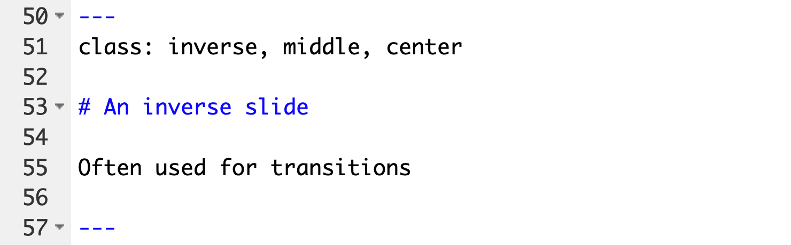
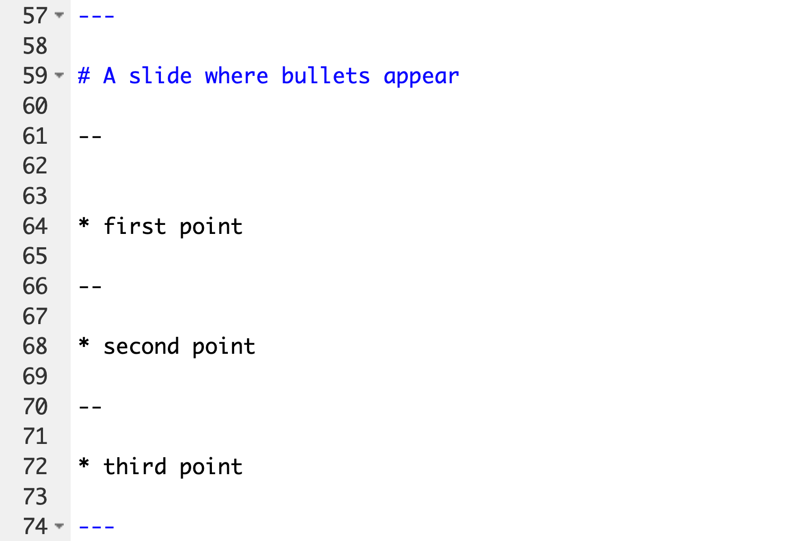

```{r meta, echo=FALSE}
library(metathis)
meta() %>%
  meta_general(
    description = "An Introduction to xaringan for Presentations: The Basics",
    generator = "xaringan and remark.js"
  ) %>% 
  meta_name("github-repo" = "spcanelon/xaringan-basics-and-beyond") %>% 
  meta_social(
    title = "Sharing Your Work with xaringan &#8212; Day 1",
    url = "https://spcanelon.github.io/xaringan-basics-and-beyond/slides/day-01-basics.html#1",
    image = "https://raw.githubusercontent.com/spcanelon/xaringan-basics-and-beyond/main/slides/day-01-cover-image.png",
    image_alt = "Title slide for the day 1 slides of the Sharing Your Work with xaringan workshop series",
    og_type = "website",
    og_author = "Silvia Canelon",
    twitter_card_type = "summary_large_image",
    twitter_creator = "@spcanelon"
  )
```

```{r setup, include = FALSE}
options(htmltools.dir.version = FALSE)
library(knitr)
library(tidyverse)
library(xaringanExtra)
library(nhsrtheme)
library(NHSRdatasets)
library(icons)
# set default options
opts_chunk$set(echo=FALSE,
               collapse = TRUE,
               fig.width = 7.252,
               fig.height = 4,
               dpi = 300)

# set engines
knitr::knit_engines$set("markdown")

xaringanExtra::use_tile_view()
xaringanExtra::use_panelset()
xaringanExtra::use_clipboard()
xaringanExtra::use_webcam()
xaringanExtra::use_broadcast()
xaringanExtra::use_share_again()
xaringanExtra::style_share_again(
  share_buttons = c("twitter", "linkedin", "pocket")
)

# uncomment the following lines if you want to use the NHS-R theme colours by default
# scale_fill_continuous <- partial(scale_fill_nhs, discrete = FALSE)
# scale_fill_discrete <- partial(scale_fill_nhs, discrete = TRUE)
# scale_colour_continuous <- partial(scale_colour_nhs, discrete = FALSE)
# scale_colour_discrete <- partial(scale_colour_nhs, discrete = TRUE)
```

class: title-slide, right, top
background-image: url(img/hex-xaringan.png), url(img/frame-art.png)
background-position: 90% 75%, 75% 75%
background-size: 8%, cover

.right-column[
# `r rmarkdown::metadata$title`
### `r rmarkdown::metadata$subtitle`

**`r rmarkdown::metadata$author`**<br>
`r rmarkdown::metadata$date`
]

.palegrey[.left[.footnote[Graphic by [Vernon Adams](https://www.rawpixel.com/image/575297/artistic-canvas-background-template)]]]

???

Welcome to the workshop on sharing your work with xaringan.

Where I'll show you how to create impressive presentation slides that can be deployed to the web for easy sharing.

---
name: about-me
layout: false
class: about-me-slide, inverse, middle, center

# About me


## Silvia Canelón

### Postdoctoral Research Scientist

.fade[University of Pennsylvania<br>Philadelphia, PA, USA]

[`r icons::fontawesome("link")` silvia.rbind.io](https://silvia.rbind.io)
[`r icons::fontawesome("twitter")` @spcanelon](https://twitter.com/spcanelon)
[`r icons::icon_style(icons::fontawesome("github"), scale = 1)` @spcanelon](https://github.com/spcanelon)

---
layout: true

<a class="footer-link" href="http://bit.ly/xaringan-nhsr">bit.ly/xaringan-nhsr &mdash; Silvia Canelón</a>

<!-- this adds the link footer to all slides, depends on footer-link class in css-->

---
class: top

# Acknowledgments

.pull-left-narrow[.center[]]

.pull-right-wide[
[Laurie Baker](https://lauriebaker.rbind.io), co-pilot for this workshop and Data Science Lecturer at the Data Science Campus, Office for National Statistics, UK.as
]

--

.pull-left-narrow[.center[
]]

.pull-right-wide[
[NHS-R Community](https://nhsrcommunity.com/) for the opportunity to provide this workshop
- [nhsrtheme `r emo::ji("package")`](https://github.com/nhs-r-community/nhsrtheme) developed by Tom Jemmett
- [NHSRdatasets `r emo::ji("package")`](https://github.com/nhs-r-community/NHSRdatasets) developed by Chris Mainey
]

--

.pull-left-narrow[.center[
`r icons::icon_style(icons::fontawesome("smile"), scale = 3, color = "#e5bf00")`]]

.pull-right-wide[
- [xaringan `r emo::ji("package")`](https://github.com/yihui/xaringan#xaringan) developed by Yihui Xie
- [xaringanExtra `r emo::ji("package")`](https://github.com/gadenbuie/xaringanExtra/#xaringanExtra) developed by Garrick Aden-Buie
- Materials developed by [Alison Hill](https://twitter.com/apreshill) that have inspired and informed this workshop
]

---
class: left

# About you

--

.pull-left-narrow[
.center[`r icons::icon_style(icons::fontawesome("markdown"), scale = 2)`]]
.pull-right-wide[### you know Markdown]

--

.pull-left-narrow[.center[
]]
.pull-right-wide[### you know R Markdown]

--

.pull-left-narrow[
.center[`r icons::icon_style(icons::fontawesome("html5"), scale = 2)`]]
.pull-right-wide[### .my-gold[**you want to know about cool HTML5 slides**]] 

---

name: question
class: inverse, middle, center

{{content}}

---
template: question

`r icons::icon_style(icons::fontawesome("images"), scale = 3)`
# How do we make<br>cool HTML5 slides?

---

## It takes a team

.panelset[
.panel[.panel-name[remark.js]
.pull-left[
.center[
<i class="fab fa-js fa-3x"></i><br>
JavaScript

**and**

<i class="fab fa-markdown fa-3x"></i><br>
Markdown
]
]
.pull-right[
> .my-coral[A simple, in browser, Markdown driven slideshow tool] .fade[targeted at people who know their way around HTML and CSS]

```{r}
knitr::include_url("https://remarkjs.com", height = "250px")
```
]
] <!---->


.panel[.panel-name[xaringan]
.pull-left[
.center[


**xaringan** is a package that introduces `remark.js` to R Markdown


]]
.pull-right[
```{r}
knitr::include_url("https://slides.yihui.org/xaringan")
```

]
] <!---->


.panel[.panel-name[CSS]
**CSS** stands for **C**ascading **S**tyle **S**heet, and turns
.pull-left[
functional, but dull HTML (content)...

]

.pull-right[
...into HTML (content) with style! `r emo::ji("sunglasses")`

]
] <!---->
] <!--end of panelset-->

???
Remark helps us:
- create a new slide (Markdown syntax* and slide properties);
- format a slide (e.g. text alignment);
- configure the slideshow;
- and use the presentation (keyboard shortcuts).

---
# CSS for the &nbsp; 

.pull-left[
```{r}
knitr::include_url("https://spcanelon.github.io/xaringan-basics-and-beyond/nhsr-theme/sample-4-3.html")
```
]

.pull-right[
I designed a custom CSS theme for the NHS-R Community following the [NHS identity guidelines](https://www.england.nhs.uk/nhsidentity/identity-guidelines/) `r emo::ji("rocket")`. 

[Tom Jemmett](https://github.com/tomjemmett) helped me incorporate it into the [nhsrtheme `r emo::ji("package")`](https://github.com/nhs-r-community/nhsrtheme#nhs-r-theme-) in preparation for this workshop.
]

---

## Getting started

.panelset[
.panel[.panel-name[nhsrtheme]
**Step 1.** Install the `nhsrtheme` package from GitHub
```{r, eval=FALSE, echo=TRUE}
# install.packages("devtools")
devtools::install_github("nhs-r-community/nhsrtheme")
```

**Step 2.** Load the `nhsrtheme` package
```{r, eval=FALSE, echo=TRUE}
library(nhsrtheme)
```
] <!---->

.panel[.panel-name[New Rmd File]
.pull-left[
1. New File
2. New R Markdown

]

.pull-right[
3\. From Template `r icons::fontawesome("angle-double-right")` NHS-R Presentation<br>4. Give your slide deck a name!

]
]<!---->

.panel[.panel-name[Directory]
The new directory in the "Files" pane contains
.left[
+ `r icons::fontawesome("file-code")` the new Rmd file (i.e. `my-slides.Rmd`)

+ `r icons::fontawesome("folder-open")` the `img` folder containing logo files

+ `r icons::fontawesome("folder-open")` the `css` folder containing the custom `nhsr` theme files<br>.small[and an HTML file in charge of [adding the NHS logo to each slide](https://www.garrickadenbuie.com/blog/xaringan-tip-logo-all-slides)]
]
] <!---->

.panel[.panel-name[YAML 1]
```{r, eval=FALSE, echo=TRUE}
title: "Presentation title"
subtitle: "Presentation subtitle"
author: "Author Name"
institute: "NHS Organisation"
date: "Presentation Date"
output:
  xaringan::moon_reader:               # new kind of output!
    css:                               
     -default                          # default xaringan theme CSS file
     -css/nhsr.css                     # custom primary CSS file
     -css/nhsr-fonts.css               # custom font CSS file
```
] <!---->

.panel[.panel-name[YAML 2]
More options for output `xaringan::moon_reader`
```{r, eval=FALSE, echo=TRUE}
    lib_dir: libs                        # creates directory for libraries
    seal: false                          # false: custom title slide
    nature:
      highlightStyle: googlecode         # highlighting syntax for code
      highlightLines: true               # true: enables code line highlighting 
      highlightLanguage: ["r"]           # languages to highlight
      countIncrementalSlides: false      # false: disables counting of incremental slides
      ratio: "16:9"                      # 4:3 for standard size
    includes:
      after_body: [css/insert-logo.html] # adds NHS logo to slides (you can ignore it)
```
] <!---->

.panel[.panel-name[Extra info]
- `seal: true` creates a title slide with inverse colors using metadata from your YAML

- Other [highlightStyle options](https://github.com/gnab/remark/wiki/Configuration#highlighting) from **remark.js** are:

  + `arta`, `ascetic`, `dark`, `default`, `far`, `github`, `googlecode`,   `idea`, `ir-black`, `magula`, `monokai`, `rainbow`, `solarized-dark`, `solarized-light`, `sunburst`, `tomorrow`, `tomorrow-night-blue`, `tomorrow-night-bright`, `tomorrow-night`, `tomorrow-night-eighties`, `vs`, `zenburn`.
] <!---->

] <!--end of panelset-->

---
name: live-coding
background-color: var(--my-yellow)
class: middle, center

`r icons::icon_style(icons::fontawesome("code"), scale = 3, color = "#122140")`<br>
# Let's try it live together

---
## Our first few slides

`r icons::icon_style(icons::fontawesome("star"), color = "#e5bf00")` Slide content starts immediately after the YAML `---`

.pull-left-narrow[
The .my-coral[nhsrtheme] xaringan template comes pre-loaded with a few things
]
.pull-right-wide[
- .my-coral[A `setup` chunk] with a few libraries and some chunk options set for the whole slide deck

- Some example slides separated by three dashes (`---`)
  1. .my-coral[Title slide with the `title-slide` class.]<br>Content is aligned with the `left` and the `bottom` of the slide
  1. .my-coral[Inverse slide with the `inverse` slide class.]<br>Content is aligned with `middle` and `center` of the slide
  1. .my-coral[Incremental slides with no specified slide class (default).]<br>Incremental steps are made using two dashes (`--`), and bullet points made using markdown (`*`)
]

---
.panelset[

.panel[.panel-name[Moon Reader]
To view the slides generated by your new Rmd file, you have two options:

**Option 1**. Run xaringan's infinite moon reader function in the console `r emo::ji("rocket")` 
```{r eval=FALSE, echo=TRUE}
xaringan::inf_mr()
```

> .small[Note: you can also access this feature using the IDE toolbar: **Addins > XARINGAN Infinite Moon Reader**]

**Option 2**. Knit the document `r emo::ji("yarn")` 

] <!---->

.panel[.panel-name[Setup chunk]
.pull-left-narrow[
A `setup` chunk with a few libraries and some chunk options set for the whole slide deck
]
.pull-right-wide[

]
] <!---->

.panel[.panel-name[Title slide]

.pull-left[
### Code

This is the very first slide after the YAML so it doesn't need to begin with `---`]
.pull-right[
### Slide
 
]
] <!---->
.panel[.panel-name[Inverse slide]

.pull-left[
### Code
]

.pull-right[
### Slide
 
]
] <!---->
.panel[.panel-name[Incremental slides]

.pull-left[
### Code
]

.pull-right[
### Slide
 
]
] <!---->
]<!--end of panelset-->

---
# xaringan syntax

### What did you notice?

???
What about the syntax used in the R Markdown file looked familiar?
Please type your answers in the chat box.

--

.pull-left[

### Familiar from **markdown**

- Headings (#, ##, ###)
- **Bold** and _italic_ type
- Links and images with ``
- Bullet points can be added<br>with `-`, `+`, or `-`
- Numbered lists can be created<br>with `1.`
]

???
What about the syntax looked new or different?
Please type your answers in the chat box.

--

.pull-right[
### Not so familiar, from **remark.js**
- First slide starts immediately after YAML, doesn't need to begin with three dashes(`---`)
- Slides are separated by<br>three dashes (`---`)
- Incremental slides are separated by<br>two dashes (`--`)
- Slide content is separated from presenter notes by three questions marks (`???`)
]

---
template: question

`r icons::icon_style(icons::fontawesome("magic"), scale = 3)`
# How can we make our slides<br>look more interesting???

--

----

.left-col[.center[
`r icons::icon_style(icons::fontawesome("th-large"), scale = 2)`
### with placement
]]

--

.center-col[
.center[
`r icons::icon_style(icons::fontawesome("image"), scale = 2)`
### pretty pictures
]]

--

.right-col[.center[
`r icons::icon_style(icons::fontawesome("star", style = "solid"), scale = 2)`
### and icons
]]

---
name: placement

## Placement <i class="fas fa-th-large" style = "float: right"></i>

---
template: placement

### Align an entire slide

.left-column[

Horizontally

```r
left,
*center,
right
```

----

Vertically

```r
top, 
*middle, 
bottom 
```
]

--

.right-column[

```r
---

*class: center, middle

# Slide with centered content in the middle

This content is also centered and in the middle of the slide 

---
```

.right[.my-coral[example on next slide `r icons::fontawesome("arrow-circle-right")` ]]
]

---
class: center, middle

# Slide with centered content and aligned with the middle

This content is also centered and aligned with the middle of the slide


---
template: placement

### Align only some text

.left-column[
Horizontal only

```r
*.left[words]
.center[words]
*.right[words]
```
]

--

.right-column[
```r
---

class: center, middle 

# Slide with some text aligned

*.left[We can start writing a sentence on the left...]

*.right[and end on the right.]

---
```

.right[.my-coral[example on next slide `r icons::fontawesome("arrow-circle-right")` ]]

]

---
class: center, middle

# Slide with some text aligned

.left[We can start writing a sentence on the left...]

.right[...and finish it on the right.]

---
template: placement

### Pull content to either side of the slide

.pull-left[
**The `.pull-left[]` class pulls content to<br>the left 47%**

Like the text above and<br>the hex sticker below


]

--

.pull-right[
**And `.pull-right[]` pulls content to<br>the right 47%**

You've already seen these content classes<br>in action today `r emo::ji("smile")`
<br>


]

--

They don't have to take up the entire slide. Like for this text, you can decide to continue creating content that isn't pulled to either side.

---
template: placement

### Arrange content into a two-column layout

.left-column[
**`.left-column[]` places content into a column 20% wide**

And text is a little lighter
]

--

.right-column[
**`.right-column[]` places content into a column 75% wide**
- It also has a _little_ bit of padding on the top

- And unlike the `.pull` content classes, these column classes are fixed for the entire slide
- They are meant to be used together

.center[
]
]

---
name: pictures
## Pictures <i class="fas fa-image" style = "float: right"></i>

---
template: pictures

There are a variety of ways to add images to your slides!

.panelset[
.panel[.panel-name[Markdown]
.pull-left[

```{markdown, eval=FALSE, echo=TRUE}

```

- simple
- not very flexible
- output size fully dependent on the size of the image, but scaling can be managed [using custom macros (JavaScript functions) ](https://slides.yihui.org/xaringan/#33)
 
.small[
Photo by [Annie Spratt](https://unsplash.com/@anniespratt)]
]

.pull-right[

]
] <!---->

.panel[.panel-name[knitr]

.pull-left[

```{r picture-knitr, eval=TRUE, echo=TRUE, fig.show="hide"}
knitr::include_graphics("img/camera-green.jpg")
```
- pretty flexible
- a little bulky
- more options [here](https://www.rdocumentation.org/packages/knitr/versions/1.30/topics/include_graphics)
]

.pull-right[
```{r, ref.label="picture-knitr", out.width="90%"}
```
]

] <!---->

.panel[.panel-name[HTML]
.pull-left[
```{html, eval=FALSE, echo=TRUE}

```
- most flexible
- a bit unsightly
- takes time to [get used to syntax](https://www.w3schools.com/html/html_images.asp)

.small[**Tip:** To insert an avatar: 
```{html, eval=FALSE, echo=TRUE}

```
]
]

.pull-right[

]

] <!---->

---
.panel[.panel-name[Image sources]

Below you'll see a few places where you can find beautiful and free background images contributed by artists all over world.

**Tip:** You can use the `.footnote[]` class to credit the source of the image ([example here](https://spcanelon.github.io/xaringan-basics-and-beyond/slides/day-01-basics.html)) `r emo::ji("slightly_smiling_face")`

.pull-left[
- [unsplash.com](unsplash.com)
- [rawpixel.com](rawpixel.com)
- [pexels.com](https://www.pexels.com/)
]

.pull-right[
> - In the public domain<br>
  (no attribution necessary)
> - Free with attribution<br>
  (e.g. Photo by [Annie Spratt](https://unsplash.com/@anniespratt))
]
] <!---->

.panel[.panel-name[Image paths]

.pull-left[
R Markdown and xaringan don't always agree on where images are located<br>(i.e. relative file paths). 

You might find that `knitr::include_graphics()` produces an image from a code chunk in your Rmd, and that the same image may not show up when you render your xaringan slides. `r emo::ji("woman_shrugging")`
]

.pull-right[
I recommend using this directory structure to help avoid confusion<br>(example file path: `img/camera-green.jpg`)

```{r eval=FALSE, echo=TRUE}
.
├── css
├── img #<<
    ├── camera-green.jpg #<<
├── libs
├── my-slides.Rmd
└── my-slides.html
```
]

]
.panel[.panel-name[Background]

You can use the [background-image property](https://github.com/gnab/remark/wiki/Markdown#background-image) underneath the `---` slide separator

- `background-image:` 
  - `url(https://insertweblink.here)` --> image from the web
  - `url(img/camera-green.jpg)` --> local image, using relative file paths
- `background-size:`
    - `cover` --> rescales + crops with no empty space
    - `contain` --> rescales only
- `background-position:` play with [this](https://css-tricks.com/almanac/properties/b/background-position/)


.right[.my-coral[`background-size` examples in action! `r icons::fontawesome("arrow-circle-right")` ]]
] <!---->

] <!--end of panelset-->

---
background-image: url(img/camera-green.jpg)
class: inverse, middle, center

# **No background-size**
**Image size: 3999x3005**

---
background-image: url(img/camera-green.jpg)
background-size: cover
class: inverse, middle, center

# **Cover**

---
background-image: url(img/camera-green.jpg)
background-size: contain
background-color: white
class: inverse, middle, center

# **Contain**

---
class: left
name: icons
## Icons <i class="fas fa-star" style = "float: right"></i>

--

.pull-left-narrow[.center[
`r emo::ji("smile")`<br>
[Emojis](https://github.com/hadley/emo#emoji)
]]
.pull-right-wide[
Use the [emo(ji) `r emo::ji("package")`](https://github.com/hadley/emo#emoji):<br>
Icon on the left: ` r emo::ji("smile")` (surrounded by backticks `)
]

--

.pull-left-narrow[.center[
<i class="fas fa-brain"></i>
<br>
[FontAwesome](https://fontawesome.com/icons?d=gallery&c=medical&m=free)
]]

.pull-right-wide[
Copy and paste html directly from the website:<br>`<i class="fas fa-brain"></i>`<br>
Use the [icon `r emo::ji("package")`](https://slides.mitchelloharawild.com/icon/): ` r icons::fontawesome("brain")`,<br>or the [fontawesome `r emo::ji("package")`](https://github.com/rstudio/fontawesome#the-fontawesome-package): ` r icons::fontawesome("brain")`
]

--

.pull-left-narrow[.center[
`r icons::academicons("orcid")`<br>
[Academicons](https://jpswalsh.github.io/academicons/)
]]
.pull-right-wide[
The easiest way to access them is with the icon `r emo::ji("package")`:<br>` r icons::fontawesome("orcid")`
]

--

.pull-left-narrow[.center[
`r icons::ionicons("flask")`<br>
[Ionicons](https://ionicons.com/)
]]
.pull-right-wide[
I haven't had as much luck with these, but you can use the icon `r emo::ji("package")` here as well: ` r icons::ionicons("flask")`
]

---
name: your-turn
background-color: var(--my-red)
class: inverse

.left-column[
## Your turn<br>`r icons::fontawesome("edit")`<br>
### .my-pink[10:00 mins]
]

.right-column[
### Make an "about me" slide

----

Think about including details like your<br>name, affiliation, location, and/or contact information

Here are some options to consider
- practice [moving content around](#placement) the slide
- separate content with a horizontal bar `----`
- [add an image](#pictures) or photo
- link to sites and/or social media
- add some [icons](#icons)!
- see [my about me slide](#about-me) for ideas
]

---
template: question

`r icons::icon_style(icons::fontawesome("r-project"), scale = 3)`
# What about R content?

--

----

.pull-left[.center[
`r icons::icon_style(icons::fontawesome("table"), scale = 2)`
### tables
]]

--

.pull-right[
.center[
`r icons::icon_style(icons::fontawesome("chart-bar"), scale = 2)`
### plots
]]

---
name: tables
## Tables <i class="fas fa-table" style = "float: right"></i>

---
template: tables

### Direct output

----

```{r, echo=TRUE}
NHSRdatasets::LOS_model %>% head()
```

.footnote[We're using the [NHSRdatasets `r emo::ji("package")`](https://github.com/nhs-r-community/NHSRdatasets#nhs-r-community-datasets-) here! It was developed by Chris Mainey and contains a few datasets to use for practice.]

---
template: tables

### HTML table

----
.pull-left[
```{r, echo=TRUE, eval=FALSE}
NHSRdatasets::LOS_model %>% head() %>%
  knitr::kable(format = "html")
```
]

.pull-right[
```{r, echo=FALSE}
NHSRdatasets::LOS_model %>% head() %>%
  knitr::kable(format = "html")
```
]

---
template: tables

### DT table

----

```{r, echo=TRUE}
NHSRdatasets::LOS_model %>% head() %>%
  DT::datatable()
```

---
template: tables
exclude: true

### GT table

----

.pull-left[
```{r, echo=TRUE, eval=FALSE}
NHSRdatasets::LOS_model %>% head() %>%
  gt::gt()
```
]

.pull-right[
```{r, echo=FALSE}
NHSRdatasets::LOS_model %>% head() %>%
  gt::gt()
```
]

.footnote[Make sure to check out the [GT package workshop](https://github.com/nhs-r-community/Conference_2020#workshop-sessions) tomorrow!]
---
name: plots
## Plots <i class="fas fa-chart-bar" style = "float: right"></i>

---
template: plots
name: plot-right

.pull-left[
### Code

----

```{r plot-right, echo=TRUE, fig.show='hide'}
NHSRdatasets::LOS_model %>%
  ggplot(aes(x = Age, y = Organisation)) +
  geom_boxplot(aes(fill = Organisation)) +
  nhsrtheme::scale_fill_nhs("highlights")
```
]

.pull-right[

### Plot

----

```{r, ref.label="plot-right"}
```

]

.footnote[Note the use of the [nhsrtheme `r emo::ji("package")`](https://github.com/nhs-r-community/nhsrtheme#nhs-r-theme-) here! It was developed by Tom Jemmett and contains a few different colour palettes based on the NHS identity guidelines]
---
template: plots
name: alison-tips

### Creating side-by-side code + plot

----

Here's how to leverage code chunk options to avoid repeating your code<sup1/sup>:

1. Code on left, plot on right ([example](#plot-right))

  - Chunk 1: `{r plot-right, fig.show = 'hide'}`
  - Chunk 2: `{r ref.label = 'plot-right', echo = FALSE}`

2. Plot on left, code on right
  - Chunk 1: `{r plot-left, echo = FALSE}`
  - Chunk 2: `{r ref.label = 'plot-left', fig.show = 'hide'}`

.small[
These and more great tips in Alison Hill's [Teaching in Production](https://rstudio-education.github.io/teaching-in-production/slides/index.html#46)
]

---
name: your-turn
background-color: var(--my-red)
class: inverse

.left-column[
## Your turn<br>`r icons::fontawesome("edit")`<br>
### .my-pink[10:00 mins]
]

.right-column[
### Make a new slide and practice<br>adding some R content

----

Here are some options to consider
- add a [table](#tables)
- add a [plot](#plots)
- try [arranging content](#alison-tips) to have code on one side and the output on the other
]

---
template: live-coding

### Let's try deploying slides to GitHub!

---
class: goodbye-slide, inverse, middle, left

.pull-left[

# Thank you!

### Here's where you can find me...

.right[
[silvia.rbind.io `r icons::fontawesome("link")`](https://silvia.rbind.io)<br/>
[@spcanelon `r icons::fontawesome("twitter")`](https://twitter.com/spcanelon)<br/>
[@spcanelon `r icons::fontawesome("github")`](https://github.com/spcanelon)<br/>
]]

