```{r meta, echo=FALSE}
library(metathis)
meta() %>%
  meta_general(
    description = "An Introduction to xaringan for Presentations: The Basics and Beyond",
    generator = "xaringan and remark.js"
  ) %>% 
  meta_name("github-repo" = "spcanelon/xaringan-basics-and-beyond") %>% 
  meta_social(
    title = "Sharing Your Work with xaringan",
    url = "https://spcanelon.github.io/xaringan-basics-and-beyond",
    image = "https://github.com/spcanelon/xaringan-basics-and-beyond/blob/main/xaringan-nhsr-general.png",
    image_alt = "Title slide for the Sharing Your Work with xaringan workshop series",
    og_type = "website",
    og_author = "Silvia Canelon",
    twitter_card_type = "summary_large_image",
    twitter_creator = "@spcanelon"
  )
```

```{r setup, include = FALSE}
options(htmltools.dir.version = FALSE)
library(knitr)
library(tidyverse)
library(xaringanExtra)
library(nhsrtheme)
library(NHSRdatasets)
# set default options
opts_chunk$set(collapse = TRUE,
               dpi = 300,
               comment = "#")

xaringanExtra::use_tile_view()
xaringanExtra::use_clipboard()

xaringanExtra::use_panelset()

xaringanExtra::use_share_again()
xaringanExtra::style_share_again(
  share_buttons = c("twitter", "linkedin", "pocket")
)
xaringanExtra::use_extra_styles(
  hover_code_line = TRUE,         #<<
  mute_unhighlighted_code = TRUE  #<<
)
# uncomment the following lines if you want to use the NHS-R theme colours by default
# scale_fill_continuous <- partial(scale_fill_nhs, discrete = FALSE)
# scale_fill_discrete <- partial(scale_fill_nhs, discrete = TRUE)
# scale_colour_continuous <- partial(scale_colour_nhs, discrete = FALSE)
# scale_colour_discrete <- partial(scale_colour_nhs, discrete = TRUE)
```

class: title-slide, right, top
background-image: url(img/hex-xaringan.png), url(img/frame-art.png)
background-position: 90% 75%, 75% 75%
background-size: 8%, cover

.right-column[
# `r rmarkdown::metadata$title`
### `r rmarkdown::metadata$subtitle`

**`r rmarkdown::metadata$author`**<br>
`r rmarkdown::metadata$date`
]

.palegrey[.left[.footnote[Graphic by [Vernon Adams](https://www.rawpixel.com/image/575297/artistic-canvas-background-template)]]]

???

Welcome to the workshop on sharing your work with xaringan.

Where I'll show you how to create impressive presentation slides that can be deployed to the web for easy sharing.

---
name: about-me
layout: false
class: about-me-slide, inverse, middle, center

# About me


## Silvia Canelón

### Postdoctoral Research Scientist

.fade[University of Pennsylvania<br>Philadelphia, PA, USA]

[`r icon::fa("link")` silvia.rbind.io](https://silvia.rbind.io)
[`r icon::fa("twitter")` @spcanelon](https://twitter.com/spcanelon)
[`r icon::fa("github", size = 1)` @spcanelon](https://github.com/spcanelon)

---
layout: true

<a class="footer-link" href="http://bit.ly/xaringan-nhsr">bit.ly/xaringan-nhsr &mdash; Silvia Canelón</a>

<!-- this adds the link footer to all slides, depends on footer-link class in css-->

---
class: top

# Acknowledgments

.pull-left-narrow[.center[]]

.pull-right-wide[
[Laurie Baker](https://lauriebaker.rbind.io), co-pilot for this workshop and Data Science Lecturer at the Data Science Campus, Office for National Statistics, UK.as
]

--

.pull-left-narrow[.center[
]]

.pull-right-wide[
[NHS-R Community](https://nhsrcommunity.com/) for the opportunity to provide this workshop
- [nhsrtheme `r emo::ji("package")`](https://github.com/nhs-r-community/nhsrtheme) developed by Tom Jemmett
- [NHSRdatasets `r emo::ji("package")`](https://github.com/nhs-r-community/NHSRdatasets) developed by Chris Mainey
]

--

.pull-left-narrow[.center[
`r icon::fa("smile", size = 3, color = "#e5bf00")`]]

.pull-right-wide[
- [xaringan `r emo::ji("package")`](https://github.com/yihui/xaringan#xaringan) developed by Yihui Xie
- [xaringanExtra `r emo::ji("package")`](https://github.com/gadenbuie/xaringanExtra/#xaringanExtra) developed by Garrick Aden-Buie
- Materials developed by [Alison Hill](https://twitter.com/apreshill) that have inspired and informed this workshop
]

---
class: left

# About you

--
.pull-left-narrow[.center[
]]
.pull-right-wide[### you know xaringan]

--

.pull-left-narrow[.center[
<i class="far fa-grin-stars fa-2x"></i>]]
.pull-right-wide[### you've seen pretty slides in the wild]

--

.pull-left-narrow[.center[
<i class="fas fa-images fa-2x"></i>]]
.pull-right-wide[### .my-gold[**you want to make your own pretty slides**]] 

---
class: left

# About .my-gold[future] you

--

.pull-left-narrow[.center[
# **&#x1F3A1;**]]
.pull-right-wide[.center[### **you can make your slides .my-gold[extra special]<br>with the xaringanExtra `r emo::ji("package")`**]]

--

.pull-left-narrow[.center[
<i class="fab fa-css3 fa-2x"></i>]]
.pull-right-wide[### **you can customize your slides .my-gold[using CSS**]] 

---
name: question
class: inverse, middle, center

---
template: question

# `r fontawesome::fa("hat-wizard", fill = "#E8EDEE")`
# What's the extra?

--

----

.left-col[.center[
`r icon::fa("th", size = 2)`
### slide overview
]]

--

.center-col[
.center[
`r icon::fa("share-square", size = 2)`
### slide embedding
]]

--

.right-col[.center[
`r icon::fa("folder", size = 2)`
### slide panels
]]

---
### These .my-gold[extra] features are made possible by the [xaringanExtra `r emo::ji("package")`](https://github.com/gadenbuie/xaringanExtra#xaringanextra)

> `r emo::ji("ferris_wheel")` A playground of enhancements and extensions for xaringan slides.

```{r, echo=FALSE}
knitr::include_url("https://pkg.garrickadenbuie.com/xaringanExtra/#/?id=xaringanextra")
```
.small[[pkg.garrickadenbuie.com/xaringanExtra](https://pkg.garrickadenbuie.com/xaringanExtra/#/?id=xaringanextra)]

---
name: demo-tile-view

## Slide overview with [Tile View](https://github.com/gadenbuie/xaringanExtra#-tile-view-demo) <i class="fas fa-th" style = "float: right"></i>

.panelset[

.panel[.panel-name[Example]
.center[
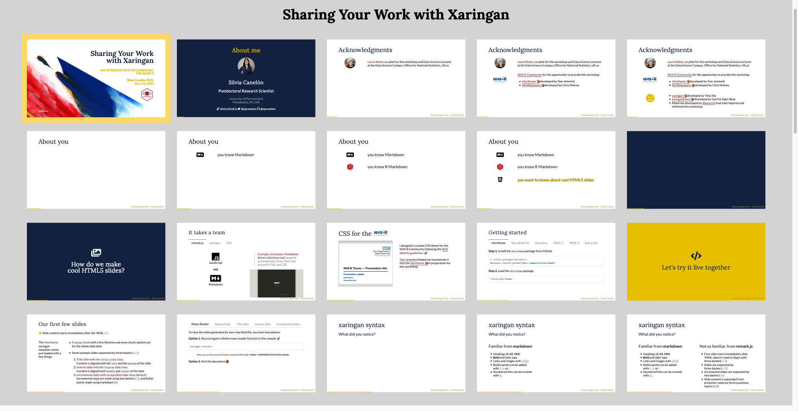
]
] <!---->

.panel[.panel-name[How-to]
**Step 1.** Install xaringanExtra from GitHub
```{r, eval=FALSE}
devtools::install_github("gadenbuie/xaringanExtra")
```

**Step 2.** Load the library and add the `use_tile_view()` function to your setup chunk

```{r, eval=FALSE}
library(xaringanExtra)
xaringanExtra::use_tile_view()
```

**Step 3.** Save and render your slides

**Step 4.** Press the letter "O" (for **O**verview) on your keyboard to see a slide overview!<br>
.small[You can also try pressing "O" right now!]

] <!---->

] <!--end of panelset-->


---
name: demo-share-again

## Slide embedding with [Share Again](https://github.com/gadenbuie/xaringanExtra#-share-again) <i class="fas fa-share-square" style = "float: right"></i>

.panelset[

.panel[.panel-name[Example]
.center[
```{r, echo=FALSE, out.width="70%"}
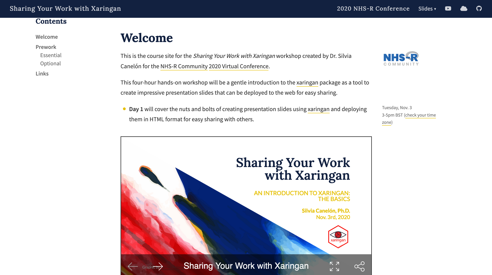
```
<br>.small[[spcanelon.github.io/xaringan-basics-and-beyond](https://spcanelon.github.io/xaringan-basics-and-beyond/)]]

] <!--end of panelset-->

.panel[.panel-name[How-to]

.pull-left-narrow[
**Now**, in your current document
]

.pull-right-wide[
**Step 1.** Add the `use_share_again()` function to your setup chunk

```{r xaringan-share-again, eval=FALSE}
xaringanExtra::use_share_again()
```

**Step 2.** Style share bar and choose social media sites in setup chunk

```{r style-share-again, eval=FALSE}
xaringanExtra::style_share_again(share_buttons = c("twitter", "linkedin", "pocket"))
```
]

.pull-left-narrow[
**Later**, in a different document
]

.pull-right-wide[
**Step 3.** Embed your slides in blogdown or R Markdown HTML docs 
```{r embed-xaringan, eval=FALSE, echo=TRUE}
xaringanExtra::embed_xaringan(url = "my-slides.html", ratio = "16:9")
```
]]

] <!--end of panelset-->

---
name: your-turn
background-color: var(--my-red)
class: inverse

.left-column[
## Your turn<br>`r icon::fa("edit")`<br>
### [.my-pink[5:00 mins]](https://apps.garrickadenbuie.com/countdown/)
]

.right-column[

### Make your slides a little extra

----

Options:
1. Slide overview feature with [tile view](#demo-tile-view)
2. Slide embedding feature with [share again](#demo-share-again)
]

---
name: panelset-how-to

## Slide panels with [Panelset](https://github.com/gadenbuie/xaringanExtra#-panelset) <i class="fas fa-folder" style = "float: right"></i>

.panelset[

.panel[.panel-name[Example]
```{r, echo=FALSE}
knitr::include_url("https://spcanelon.github.io/xaringan-basics-and-beyond/slides/day-02-beyond.html#demo-tile-view")
```
.small[[spcanelon.github.io/xaringan-basics-and-beyond/slides/day-02-beyond.html#demo-tile-view](https://spcanelon.github.io/xaringan-basics-and-beyond/slides/day-02-beyond.html#demo-tile-view)]
] <!---->

.panel[.panel-name[How-to]

.pull-left[
**Step 1.** Add the `use_panelset()` function to your setup chunk

```{r, eval=FALSE}
xaringanExtra::use_panelset()
```

]

.pull-right[
**Step 2.** Create a `.panelset[]` containing a `.panel[]` that itself has a `.panel-name[]`
```markdown
.panelset[
.panel[.panel-name[NAME]
...your content goes here...
] <!--end of panel-->
] <!--end of panelset-->
```
.small[.right[See this example in the next slide `r icon::fa("arrow-circle-right")`]]
]

`r emo::ji("star")` **Tip:** The nested class brackets can get a little confusing, so I like to add a comment to signal the "end" of a set of brackets. Comments in html are written like this: `<!---->`

] <!---->

] <!--end of panelset-->

---
name: example-panelset

### Example from [this panelset slide](#panelset-how-to)

.panelset[
.panel[.panel-name[NAME]
...your content goes here...
] <!--end of panel-->
] <!--end of panelset-->

---
name: live-coding
background-color: var(--my-yellow)
class: middle, center

`r icon::fa("code", size = 3, color = "#122140")`<br>
# Let's try it live together

---
name: your-turn
background-color: var(--my-red)
class: inverse

.left-column[
## Your turn<br>`r icon::fa("edit")`<br>
### [.my-pink[5:00 mins]](https://apps.garrickadenbuie.com/countdown/)
]

.right-column[
### Add another panel to the slide template<br>provided below

----

**Tip:** you can hover over the code chunk and see the "Copy Code" button in the top-right corner `r emo::ji("slightly_smiling_face")`

```markdown
---
# This slide has panels

.panelset[
.panel[.panel-name[PANEL 1]
...your content goes here...
] <!--end of panel-->
] <!--end of panelset-->
---
```
.small[Hint: try adding `.panel[.panel-name[PANEL 2]]` underneath `<!--end of panel-->`]
]

---
background-image: url(img/explore.jpg)
background-size: cover
class: top, right

.my-pink[.small[Photo by [.my-pink[Dominika Roseclay]](https://www.pexels.com/photo/cubes-with-letters-on-wooden-surface-near-fern-leaves-4288760/)]]


---
template: question

`r icon::fa("css3", size = 3)`
# So how about that CSS???

--

### Let's get into it!

---
class: middle, center

# Our approach

--

----

Take a look the default xaringan styling sheet

--

Go through the modifications made to create the `nhsr` theme

--

Make some of our own helpful modifications

--

Make our own super fun and fabulous .my-gold[**party theme**] `r emo::ji("partying_face")`<br>
.small[Credit for this idea goes to Laurie Baker!]

--

----

.my-coral[**By the end** you'll have some styling skills that you can use in and out of xaringan!]

---

# CSS goes beyond xaringan

.left-column[
The CSS basics we'll cover today can be used<br>to better understand how _any website_<br>is styled.
]

.right-column[
### A little CSS know-how can go a long way.

Here are examples of `r icon::fa("r-project")` places I've managed to apply what I've learned:

- Personal [blogdown](https://bookdown.org/yihui/blogdown/) website

- [Distill](https://rstudio.github.io/distill/website.html) site for this workshop

- Xaringan slides for this workshop (of course)
]

---
name: xaringan-default-css


## xaringan's `default.css`<i class="fab fa-css3" style = "float: right"></i>

Remember in part 1 of this workshop when said that xaringan generates a directory of libraries using `lib_dir` [in the YAML](https://spcanelon.github.io/xaringan-basics-and-beyond/slides/day-01-basics.html?panelset1=yaml-2&panelset4=remark.js2&panelset5=nhsrtheme2&panelset6=moon-reader2&panelset7=markdown2#14)? 

--

The `default.css` styling sheet is tucked away in there.

--

<!--this "icons as a list" trick comes from: https://fontawesome.com/how-to-use/on-the-web/styling/icons-in-a-list-->
<ul class="fa-ul">
  <li><span class="fa-li"><i class="fas fa-folder-open"></i></span>That directory is <b>libs</b> and it contains:</li>
  <ul class="fa-ul">
    <li><span class="fa-li"><i class="fas fa-folder"></i></span>lots of different folders</li>
    <li><span class="fa-li"><i class="fas fa-folder"></i></span>for everything we could possibly need in our slide deck</li>
    <li><span class="fa-li"><i class="fas fa-folder"></i></span>depending on which packages and functions we use</li>
    <li><span class="fa-li"><i class="fas fa-folder-open"></i></span>one of these folders is <b>remark-css</b></li>
    <ul class="fa-ul">
      <li><span class="fa-li"><i class="fas fa-file-code"></i></span><b>default.css</b></li>
    </ul>
  </ul>
</ul>

--

When we make custom style sheets like `nhsr.css` or `nhsr-fonts.css` and ask xaringan to use them ([in the YAML](https://spcanelon.github.io/xaringan-basics-and-beyond/slides/day-01-basics.html?panelset1=yaml-1&panelset4=remark.js2&panelset5=nhsrtheme2&panelset6=moon-reader2&panelset7=markdown2#14)), xaringan follows those rules first and _then_ fills in the blanks with `default.css` rules.

???
So a custom style sheet need not have _all_ the same rules as `default.css`, only the ones to modify.

---
template: live-coding

### We'll take a look at the **default.css** file

---
name: css-basics

## CSS basics<i class="fab fa-css3" style = "float: right"></i>

.panelset[

.panel[.panel-name[Rules]

This is the basic structure we're going to come across. Our sheets have a bunch of CSS rules: `selectors` of various types, each with 1+ `properties` that are assigned a `value`.

<br>
.small[[css-tricks.com/complete-guide-to-css-functions](https://css-tricks.com/complete-guide-to-css-functions/)]
] <!--end of panel-->

.panel[.panel-name[Selectors]
CSS `selectors` are patterns used to select `elements`; they point to an element to style,<br>like a heading (`h1`) for example. 

.pull-left[

The rules can be written on one line...


<br>
.small[[w3schools.com/whatis/whatis_css.asp](https://www.w3schools.com/whatis/whatis_css.asp)]

.small[This rule selects all level 1 headers (`#` in Markdown) and assigns them the `color` blue and a `font-size` of 12px.]
]

.pull-right[
...or on multiple lines.
```{css, eval=FALSE}
h1 { 
  color: blue; 
  font-size: 12px;
}
```

.small[**Note**: Unlike with many `r icon::fa("r-project")` functions, `color` cannot be replaced with `colour` in CSS land `r emo::ji("disappointed")`]
]
] <!--end of panel-->

.panel[.panel-name[Class Selectors]
.pull-left[

The most common type of `selector` we'll see is the `class selector`, which begins with a `.`

Where else have we heard the term "class" or seen the `.` syntax?

----

**Tip:** Try `prismatic::colour("#272822")` in the console to get a sense for what colour that hex code maps to.
]

.pull-right[
This example from `default.css` reads
> .small[all HTML elements with class="inverse" will have a [background colour](https://css-tricks.com/almanac/properties/b/background/) `#272822`, text [colour](https://css-tricks.com/almanac/properties/c/color/) `#d6d6d6`, and some particular [text shadowing](https://css-tricks.com/almanac/properties/t/text-shadow/).]

```{css, eval=FALSE}
.inverse {
  background-color: #272822;
  color: #d6d6d6;
  text-shadow: 0 0 20px #333;
}
```
]
] <!--end of panel-->

.panel[.panel-name[Elements]
.pull-left-narrow[This CSS rule doesn't use a class selector but selects individual elements.] 

.pull-right-wide[
In this case:
> .small[all HTML elements of type `a` (anchors/links), including those of type `code` that are nested in anchors/links, are assigned the [color](https://css-tricks.com/almanac/properties/c/color/) `rgb(249, 38, 114)` and are assigned no [text decoration](https://css-tricks.com/almanac/properties/t/text-decoration/).]


```{css, eval=FALSE}
a, a > code {
  color: rgb(249, 38, 114);
  text-decoration: none;
}
```
]
] <!--end of panel-->

.panel[.panel-name[Almanac]

My go-to resource for looking up `selectors` or `property` options is the [CSS-Tricks Almanac](https://css-tricks.com/almanac/)

.center[
```{r, echo=FALSE, out.width="62%"}
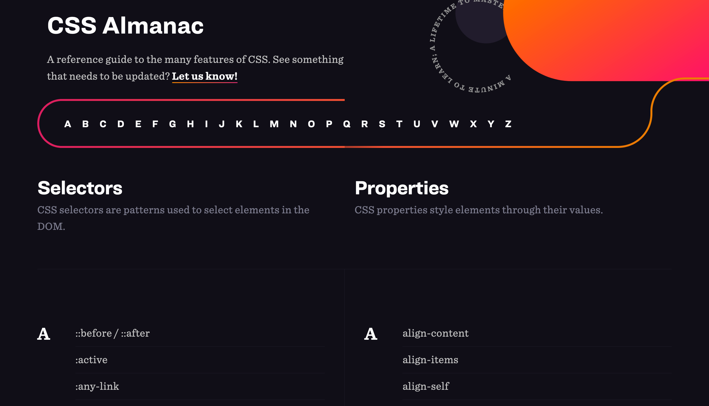
```
]

] <!--end of panel-->

] <!--end of panelset-->

---
name: css-nhsr
background-image: url(https://nhsrcommunity.com/wp-content/uploads/2018/02/logo.png)
background-size: 90px
background-position: 1020px 60px

---
template: css-nhsr

## The NHS-R theme's `nhsr.css`

The following slides will incrementally walk through the modifications made to<br>the default xaringan theme.

--

Each slide will include:

- The code as reflected in xaringan's `default.css` on the left<br>and the modified css used in the `nhsr.css` on the right.
- A visual example of the modifications made<br>using example slides [from this slide deck](https://spcanelon.github.io/xaringan-basics-and-beyond/materials/nhsr-example-slides/nhsr-example-slides.html)

.footnote[
Presenting the material this way was [kindly suggested by Laurie Baker](https://github.com/spcanelon/xaringan-basics-and-beyond/issues/8#issue-737162464)]

---
template: css-nhsr

.panelset[
.panel[.panel-name[Code]

.pull-left[
.my-coral[Anchors/links:] `default.css`

```{css, eval=FALSE}
a, a > code {
  color: rgb(249, 38, 114);
  text-decoration: none;
}
```

]

.pull-right[
.my-coral[Anchors/links:] `nhsr.css`

```{css, eval=FALSE}
a {
  color:              #005EB8;
  border-bottom:      2px solid #005EB8;
  line-height:        1.5em;
}
a:hover {
  border-bottom:      0px;
}
```

]

] <!--end of panel-->

.panel[.panel-name[Output]

.pull-left[
.my-coral[Anchors/links:] `nhsr.css`


]
.pull-right[
.my-coral[Anchors/links:] `nhsr.css`

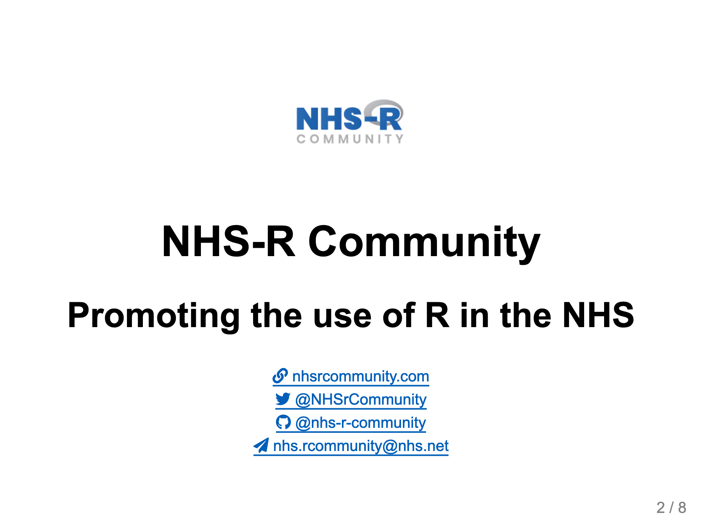

]

] <!--end of panel-->
] <!--end of panelset-->

---
template: css-nhsr

.panelset[
.panel[.panel-name[Code]

.pull-left[
.my-coral[Headings:] `default.css`

> The default xaringan theme did not change any properties from the "root" HTML file
> - paragraph text is 16px
> - text is the colour black

----

**[A note about font sizes and units](https://css-tricks.com/rems-ems/)** 
- Document level adj. should be in `px`
- Modules (i.e. classes) will scale with the document, in `rem`
- Type will scale with module, in `em`

]

.pull-right[
.my-coral[Headings:] `nhsr.css`

```{css, eval=FALSE}
.remark-slide-content h1 {
  color:              #005EB8;
  font-size:          45px;
  line-height:        1em;
}
.remark-slide-content h2 {
  font-size:          35px;
  color:              #005EB8;
  line-height:        1em;
}
.remark-slide-content h3 {
  font-size:          25px;
  color:              #005EB8;
}
```

]


] <!--end of panel-->
.panel[.panel-name[Output]

.pull-left[
.my-coral[Headings:] `default.css`

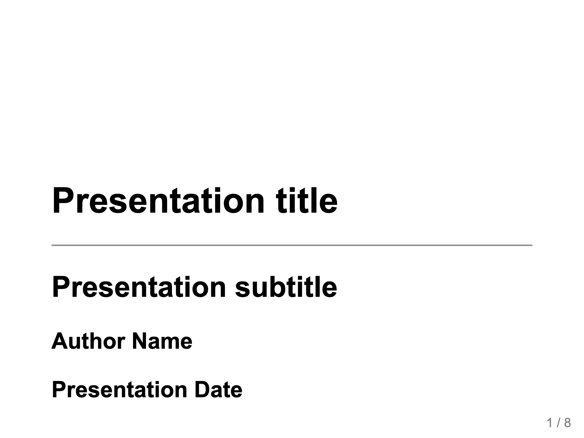
]

.pull-right[
.my-coral[Headings:] `nhsr.css`


]

] <!--end of panel-->
] <!--end of panelset-->


---
template: css-nhsr

.panelset[

.panel[.panel-name[Code]

.pull-left[
.my-coral[Paragraph text:] `default.css`

> Again, nothing specific here.

]

.pull-right[
.my-coral[Paragraph text:] `nhsr.css`

```{css, eval=FALSE}
.remark-slide-content {
  font-size:          20px;
  line-height:        1.2em;
}
```

]
] <!--end of panel-->

.panel[.panel-name[Output]

.pull-left[
.my-coral[Paragraph text:] `default.css`


]

.pull-right[
.my-coral[Paragraph text:] `nhsr.css`


]

] <!--end of panel-->

]<!--end of panelset-->

---
template: css-nhsr

.panelset[
.panel[.panel-name[Code]

.pull-left[
.my-coral[Horizontal bars:] `default.css`

> Standard values were used by xaringan.

]

.pull-right[
.my-coral[Horizontal bars:] `nhsr.css`

```{css, eval=FALSE}
hr {
  content:            none;
  display:            block;
  border:             none;
  background-color:   #231F20;
  height:             0.08em;
}
```

]

] <!--end of panel-->
.panel[.panel-name[Output]

.pull-left[
.my-coral[Horizontal bars:] `default.css`

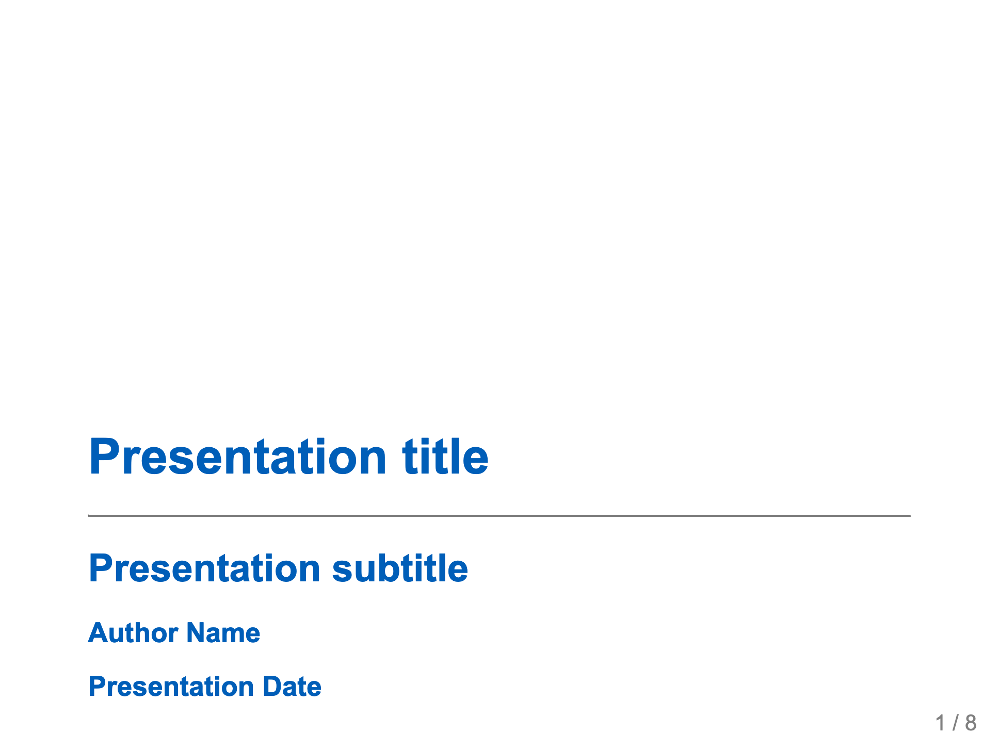
]

.pull-right[
.my-coral[Horizontal bars:] `nhsr.css`


]
] <!--end of panel-->
] <!--end of panelset-->

---
template: css-nhsr

.panelset[
.panel[.panel-name[Code]

.pull-left[
.my-coral[Bottom of slide stuff:] `default.css`

```{css, eval=FALSE}
/*-- Footnote --*/
.footnote {
  position: absolute;
  bottom: 3em;
  padding-right: 4em;
  font-size: 90%;
}
```

How do we write comments in CSS?

]

.pull-right[
.my-coral[Bottom of slide stuff:] `nhsr.css`

```{css, eval=FALSE}
/*-- Footnote --*/
.footnote {
  position:           absolute;
  bottom:             2em;
  padding-right:      4em;
  font-size:          80%;
  line-height:        1.3em;
}

/*-- Slide number --*/
.remark-slide-number {
  color:              #000000;
}
```

]

] <!--end of panel-->
.panel[.panel-name[Output]

.pull-left[
.my-coral[Bottom of slide stuff:] `default.css`


]
.pull-right[
.my-coral[Bottom of slide stuff:] `nhsr.css`


]

] <!--end of panel-->
] <!--end of panelset-->

---
template: css-nhsr

.panelset[
.panel[.panel-name[Code]

.pull-left[
.my-coral[Inline code:] `default.css`

```{css, eval=FALSE}
.remark-code-line-highlighted { background-color: #ffff88; }
```


```{css, eval=FALSE}
/* Can also be written: */

.remark-code-line-highlighted { 
  background-color: #ffff88; 
}
```

]

.pull-right[
.my-coral[Inline code:] `nhsr.css`

```{css, eval=FALSE}
/*-- In-line highlighting within text --*/
.remark-code, .remark-inline-code {
  font-size:          90%;
  font-weight:        400;
  color:              #231F20;
  background:         #E8EDEE;
  border-radius:      3px;
  padding:            1px 1px 1px 1px;
}

/*-- Line highlighting within code --*/
.remark-code-line-highlighted {
  background-color:   #E8EDEE;
}
```

]

] <!--end of panel-->


.panel[.panel-name[Output]

.pull-left[
.my-coral[Inline code:] `default.css`

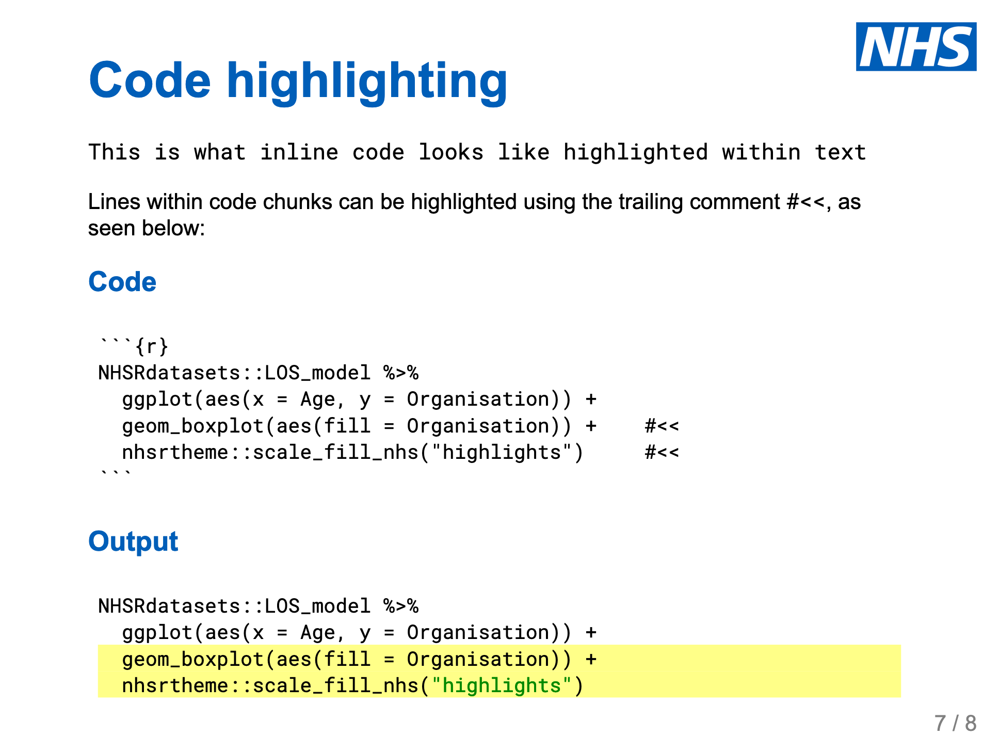
]

.pull-right[
.my-coral[Inline code:] `nhsr.css`

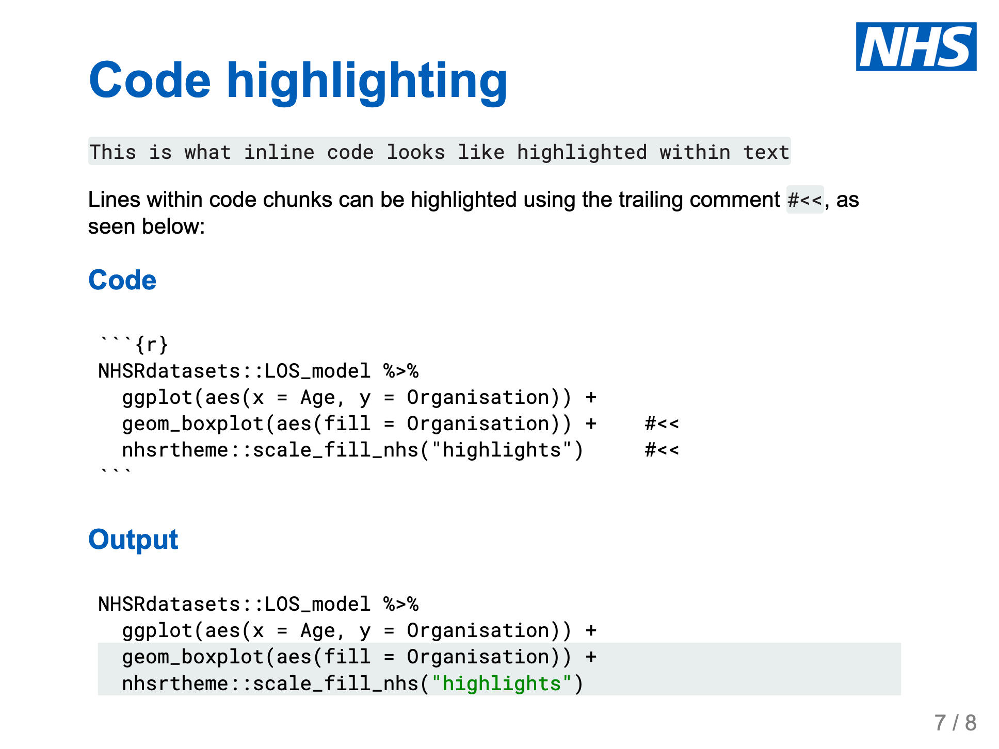
]

] <!--end of panel-->
] <!--end of panelset-->

---

template: css-nhsr

.panelset[
.panel[.panel-name[Code]

.pull-left[
.my-coral[Code chunks:] `default.css`

> Nothing specific in the xaringan default style sheet -- it's possible `highlightStyle` [in the YAML](https://spcanelon.github.io/xaringan-basics-and-beyond/slides/day-01-basics.html?panelset1=yaml-2&panelset4=remark.js2&panelset5=nhsrtheme2&panelset6=moon-reader2&panelset7=markdown2#14) takes the lead on this `r emo::ji("thinking")`

<!--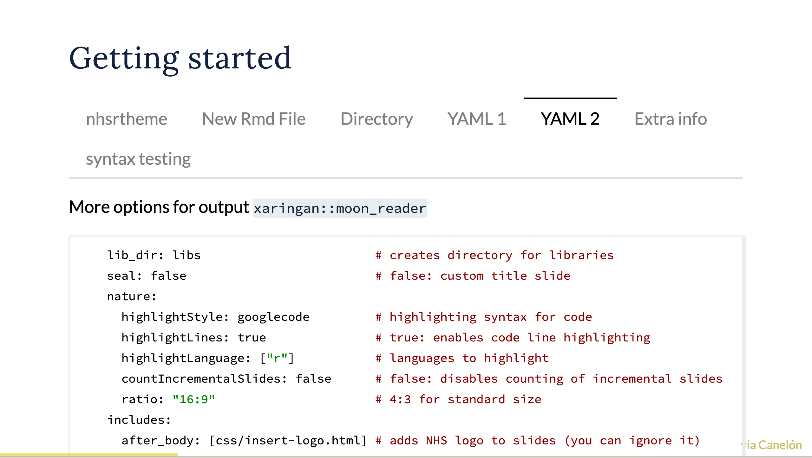-->

```{yaml, eval=FALSE}
output:
  xaringan::moon_reader:
    nature:
      highlightStyle: googlecode #<<
```
]

.pull-right[
.my-coral[Code chunks:] `nhsr.css`

```{css, eval=FALSE}
/*-- Code chunk background layer --*/
pre {
  /*border: 2px solid rgba(204, 189, 204, 0.8); /* code chunk border*/
  border:             none;
  box-shadow:         2px 2px 2px 2px #eee;
  padding:            0.1em;                    /* padding between code chunk and border */
  background:         none !important;
  overflow-x:         auto;                     /* enable horizontal scrolling with overflow */
  border-radius:      1px;                      /* modify rounding of corners*/
}
/*-- Code chunk foreground --*/
pre code {
  background:          none;
  font-size:           18px !important;
}
```

]

???
Sometimes our code won't fit vertically! What can we do? We can make the `font-size` a little smaller **or** we can use xaringanExtra's [fit to screen extension](https://github.com/gadenbuie/xaringanExtra#-fit-to-screen)


] <!--end of panel-->

.panel[.panel-name[Output]

.pull-left[
.my-coral[Code chunks:] `default.css`


]

.pull-right[
.my-coral[Code chunks:] `nhsr.css`

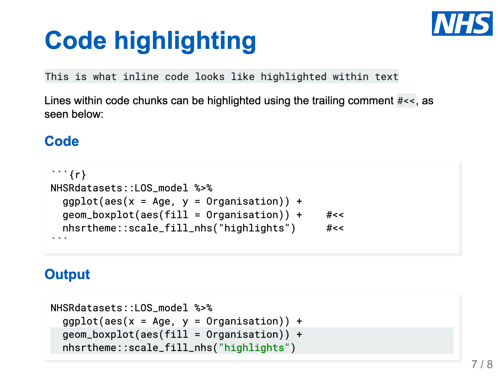
]

] <!--end of panel-->
] <!--end of panelset-->


---
template: css-nhsr

.panelset[
.panel[.panel-name[Code]

.pull-left[
.my-coral[Tables:] `default.css`

```{css, eval=FALSE}
.remark-slide table {
  margin: auto;
  border-top: 1px solid #666;
  border-bottom: 1px solid #666;
}
.remark-slide table thead th { 
  border-bottom: 1px solid #ddd; 
}
th, td { padding: 5px; 
}
.remark-slide thead, 
.remark-slide tfoot, 
.remark-slide tr:nth-child(even) { background: #eee }
```

]

.pull-right[
.my-coral[Tables:] `nhsr.css`

```{css, eval=FALSE}
.remark-slide table {
  margin:              auto;
  border-top:          1px solid #768692;
  border-bottom:       1px solid #768692;
}
/*-- Table header --*/
.remark-slide table thead th {
  border-bottom:       1px solid #768692;
}
/*-- Table rows (even) --*/
.remark-slide thead, .remark-slide tfoot, .remark-slide tr:nth-child(even) {
  background:          #E8EDEE;
}
```

]
] <!--end of panel-->

.panel[.panel-name[Output]

.pull-left[
.my-coral[Tables:] `default.css`

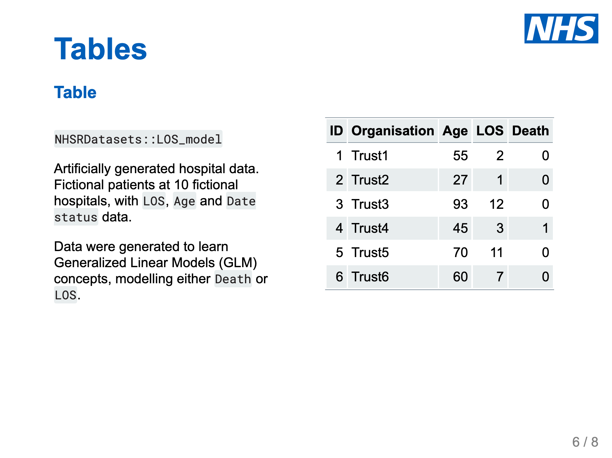
] 

.pull-right[
.my-coral[Tables:] `nhsr.css`


]

] <!--end of panel-->
] <!--end of panelset-->


---
template: css-nhsr

.panelset[
.panel[.panel-name[Code]

.pull-left[
.my-coral[Block quote:] `default.css`

> Like this one

```{css, eval=FALSE}
blockquote {
  border-left: solid 5px lightgray;
  padding-left: 1em;
}
```

]

.pull-right[
.my-coral[Block quote:] `nhsr.css`

Can you spot the difference?

```{css, eval=FALSE}
blockquote {
  border-left:         solid 5px #E8EDEE;
  padding-left:        1em;
}
```
]
] <!--end of panel-->

.panel[.panel-name[Output]

.pull-left[
.my-coral[Block quote:] `default.css`

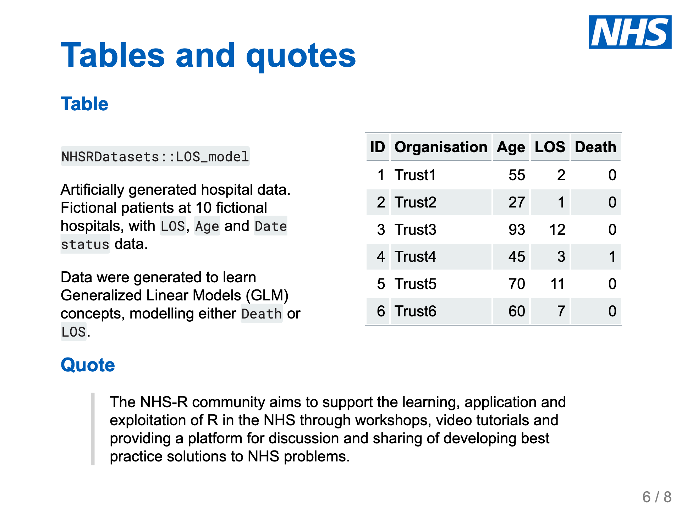
]

.pull-right[
.my-coral[Block quote:] `nhsr.css`

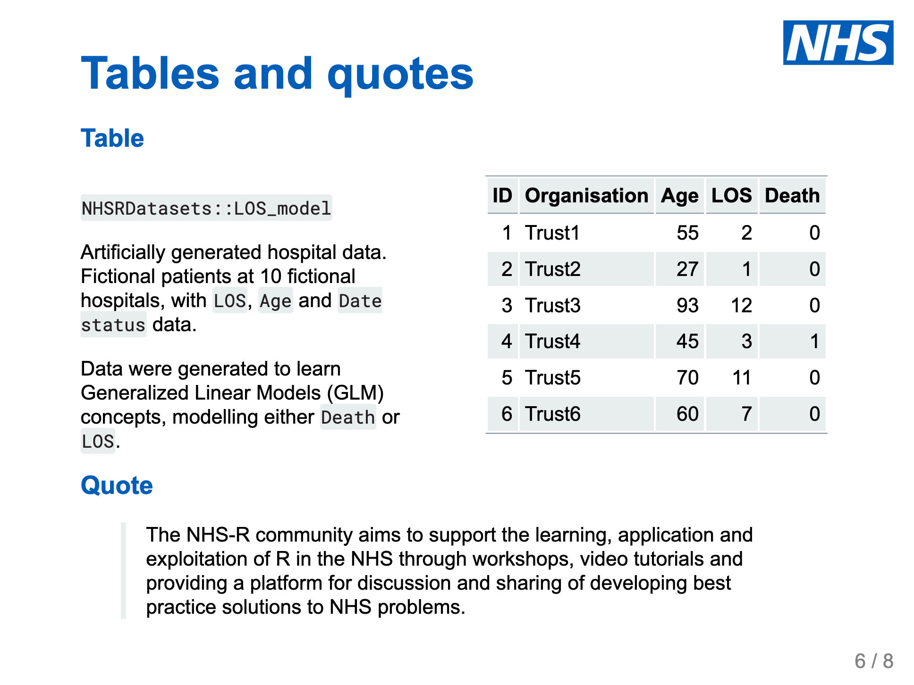
]

] <!--end of panel-->
] <!--end of panelset-->


---
template: css-nhsr

.panelset[

.panel[.panel-name[Code]

.pull-left[
.my-coral[Inverse class modifications:] `default.css`

```{css, eval=FALSE}
.inverse {
  background-color: #272822;
  color: #d6d6d6;
  text-shadow: 0 0 20px #333;
}
.inverse h1, .inverse h2, .inverse h3 {
  color: #f3f3f3;
}
```

]

.pull-right[
.my-coral[Inverse class modifications:] `nhsr.css`

```{css, eval=FALSE}
/*-- Slide background and text (inverse) --*/
.inverse {
  background-color:   #005EB8;
  color:              #FFFFFF;
  text-shadow:        none;}
/*-- Headings (inverse) --*/
.inverse h1, .inverse h2, .inverse h3 { color: #FFFFFF;}
/*-- Horizontal bars (inverse) --*/
.inverse hr { background-color:   #FFFFFF;}
/*-- Links/anchors (inverse) --*/
.inverse a {
  color:              white;
  border-bottom:      2px solid white;}
.inverse a:hover { border-bottom: none;}
```

]


] <!--end of panel-->

.panel[.panel-name[Output]

.pull-left[
.my-coral[Inverse class modifications:] `default.css`

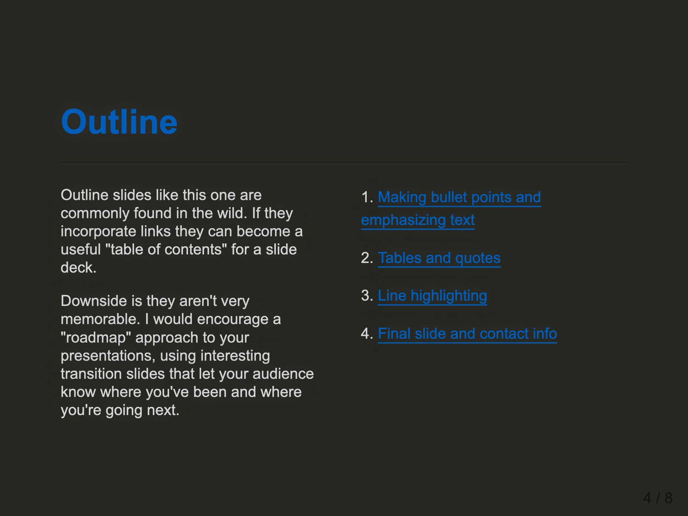
]

.pull-right[
.my-coral[Inverse class modifications:] `nhsr.css`

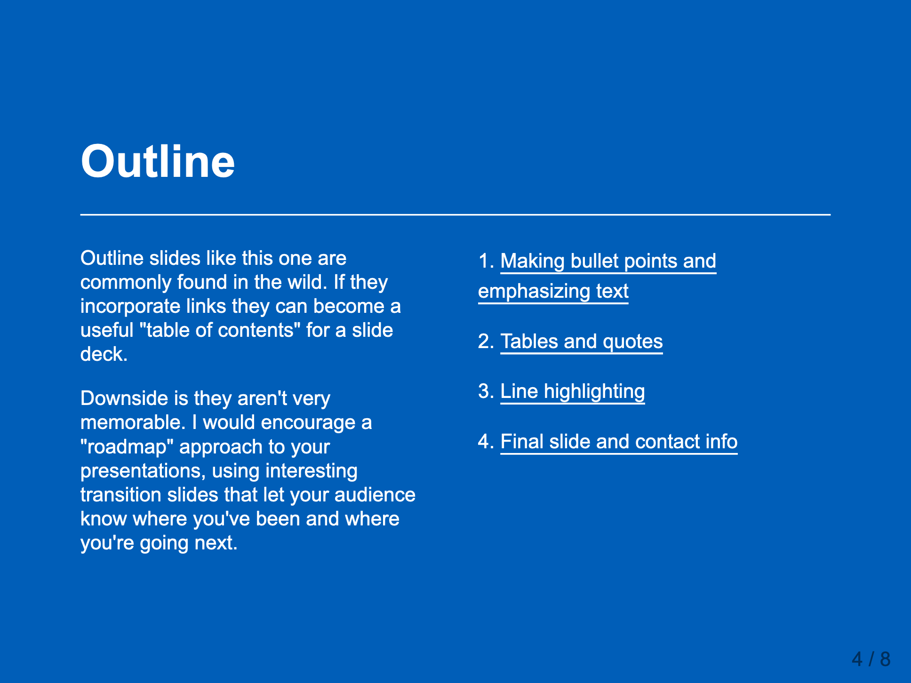
]

] <!--end of panel-->

] <!--end of panelset-->


---
template: css-nhsr

.panelset[
.panel[.panel-name[Code]

.pull-left[
.my-coral[Custom **title-slide** class:] `default.css`

> None in the default style sheet

----

Does this look familiar?

```markdown
---
class: title-slide, left, bottom

# `r '\x60r rmarkdown::metadata$title\x60'`
----
## **`r '\x60r rmarkdown::metadata$subtitle\x60'`**
### `r '\x60r rmarkdown::metadata$author\x60'`
### `r '\x60r rmarkdown::metadata$date\x60'`
---
```

<!--This is another option to show the code for teaching purposes -- many thanks to Garrick Aden-Buie for his help!:
https://github.com/gadenbuie/xaringanExtra/issues/71#issuecomment-720643949 -->

<!--<pre><code>---
class: title-slide, left, bottom

# `r '\x60r rmarkdown::metadata$title\x60'`
----
## **`r '\x60r rmarkdown::metadata$subtitle\x60'`**
### `r '\x60r rmarkdown::metadata$author\x60'`
### `r '\x60r rmarkdown::metadata$date\x60'`
---</code></pre>
-->
]

.pull-right[
.my-coral[Custom **title-slide** class:] `nhsr.css`

```{css, eval=FALSE}
/*-- NHS organisation logo --*/
.title-slide {
  background-image:    url(../img/logo-title-slide.png);
  background-position: 95% 10%;
  background-size:     300px;
}
/*-- Headings --*/
.title-slide h1 {
  color:               #000000;
}
/*-- Hides slide number from title slide --*/
.title-slide .remark-slide-number {
  display:             none;
}
```

]


] <!--end of panel-->
.panel[.panel-name[Output]

.pull-left[
.my-coral[Custom **title-slide** class:] `default.css`


]

.pull-right[
.my-coral[Custom **title-slide** class:] `nhsr.css`

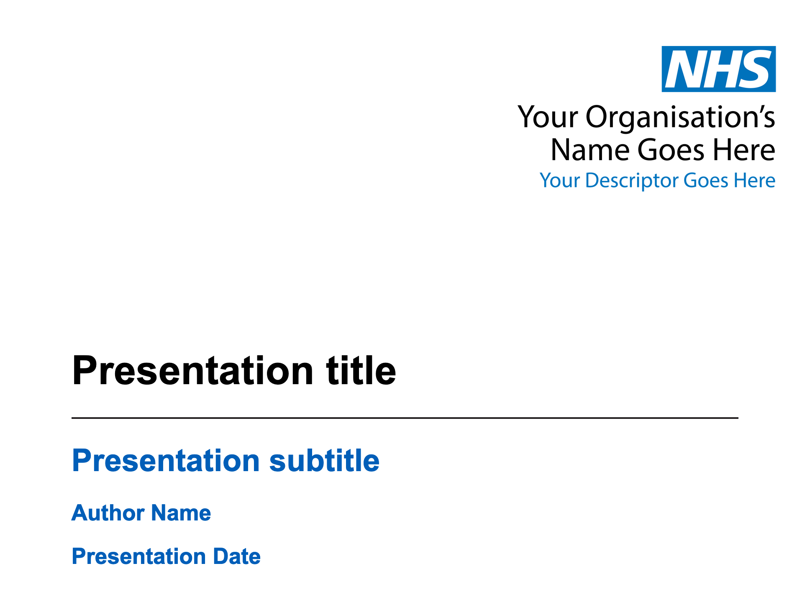
]
] <!--end of panel-->
] <!--end of panelset-->

---
template: css-nhsr

.panelset[
.panel[.panel-name[Code]

.pull-left[
.my-coral[Custom color classes:] `default.css`

> None in the default style sheet

]

.pull-right[
.my-coral[Custom color classes:] `nhsr.css`

```{css, eval=FALSE}
/*-- CUSTOM CLASSES FOR TEXT EMPHASIS --*/
.blue       { color:   #005EB8 }
.green      { color:   #009639 }
.pink       { color:   #AE2573 }
.red        { color:   #DA291C }
.warmyellow { color:   #FFB81C }
```

You can use these by writing something like this in your slides R Markdown:
```{css, eval=FALSE}
.pink[Some pink text here]
```

.pink[Some pink text here]

]
] <!--end of panel-->

.panel[.panel-name[Output]

.pull-left[
.my-coral[Custom color classes:] `default.css`

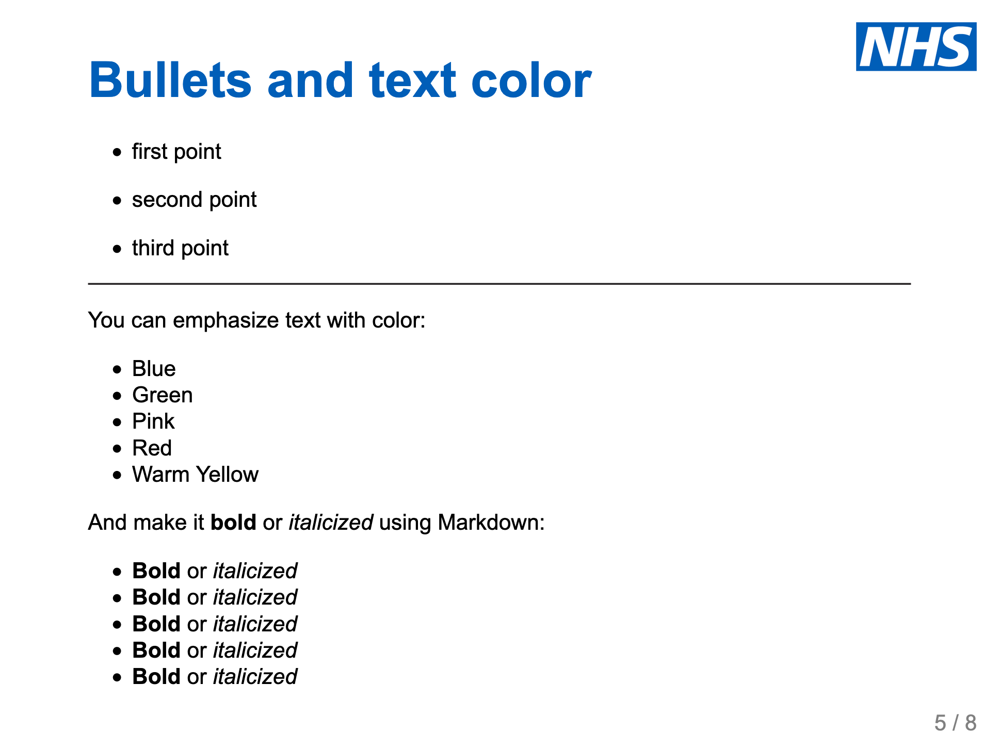
]

.pull-right[
.my-coral[Custom color classes:] `nhsr.css`

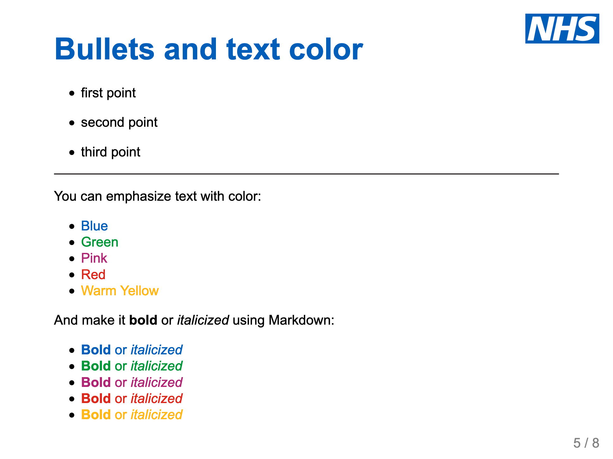
]

] <!--end of panel-->
] <!--end of panelset-->


---
name: your-turn
background-color: var(--my-red)
class: inverse

.left-column[
## Your turn<br>`r icon::fa("edit")`<br>
### [.my-pink[1:00 min]](https://apps.garrickadenbuie.com/countdown/)
]

.right-column[
### Try adding one of the custom classes below<br>to your `nhsr.css` file and try it out<br>in your slide Rmd file with `.fade[]` or `.small[]`

----

**Remember:** you can hover over the code chunk and see the "Copy Code" button in the top-right corner `r emo::ji("slightly_smiling_face")`

```{css, eval=FALSE}
.fade { 
  opacity: 0.5; 
}
```

```{css, eval=FALSE}
.small { 
  font-size: 70% 
}
```

]

---

## Let's talk colours<i class="fas fa-palette" style = "float: right"></i>

.panelset[
.panel[.panel-name[Light Palettes]
```{r, echo=FALSE}
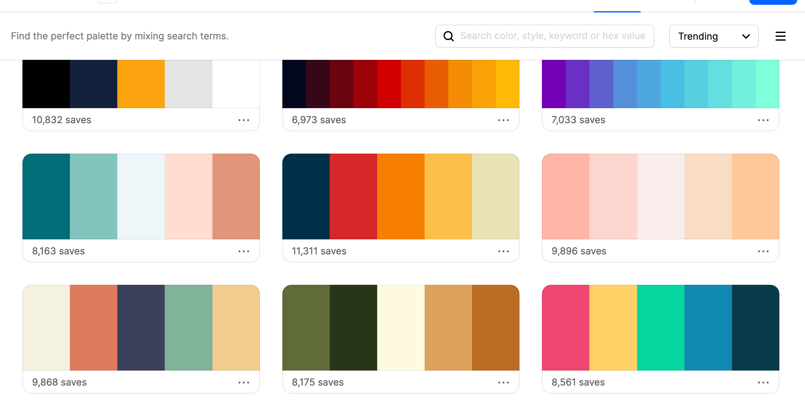
```
[coolors.co/palettes/trending](https://coolors.co/palettes/trending)

] <!--end of panel-->
.panel[.panel-name[Dark Palettes]
```{r, echo=FALSE}
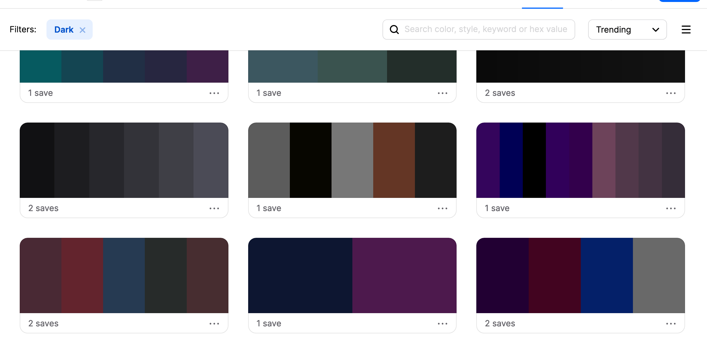
```
[coolors.co/palettes/trending/dark](https://coolors.co/palettes/trending/dark)
] <!--end of panel-->

.panel[.panel-name[NHS identity]

.pull-left[.center[
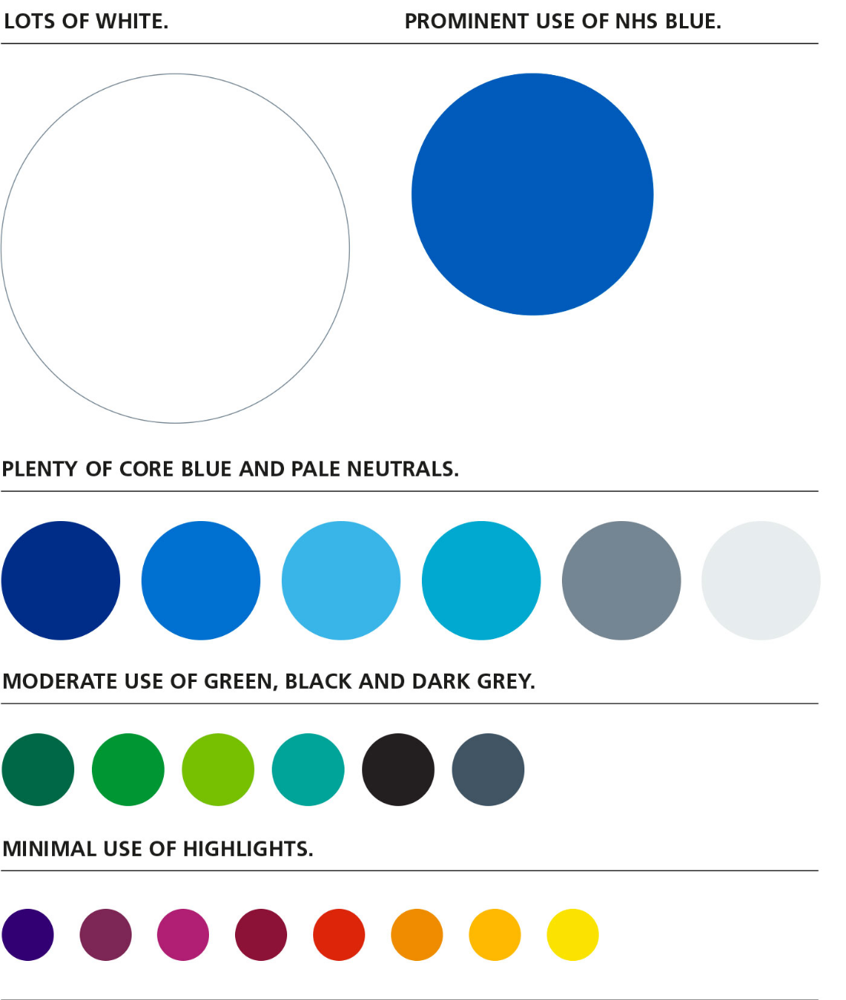
]]

.pull-right[
The [NHS identity](https://www.england.nhs.uk/nhsidentity/identity-guidelines/colours/) colour hex codes `r emo::ji("paint")`

```{r, echo=FALSE, collapse = FALSE}
nhsrtheme::getNhsColours()
```

]

] <!--end of panel-->

.panel[.panel-name[More resources]
- Check your colour combinations for contrast:
  - https://coolors.co/contrast-checker

- Generate and save your own colour palettes:
  - https://coolors.co/generate
  - https://mycolor.space

- Quickly look up hex colour codes:
  - https://www.color-hex.com
  - https://www.w3schools.com
  
.small[Thanks to Laurie Baker and Josie Browning for kindly adding resources to these lists]
  
] <!--end of panel-->

]<!--end of panelset-->

---

## Let's talk fonts<i class="fas fa-font" style = "float: right"></i>

.panelset[

.panel[.panel-name[NHS identity]

The [NHS identity guidelines](https://www.england.nhs.uk/nhsidentity/identity-guidelines/fonts/) encourage:

.pull-left[
**Frutiger** as the core font...

```{r, echo=FALSE}
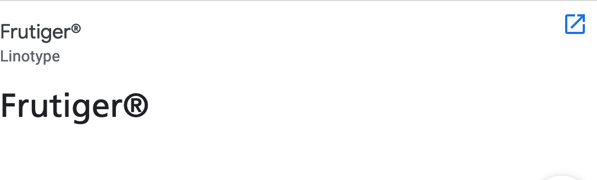
```
]

.pull-right[
...and **Arial** as a secondary font.

```{r, echo=FALSE}
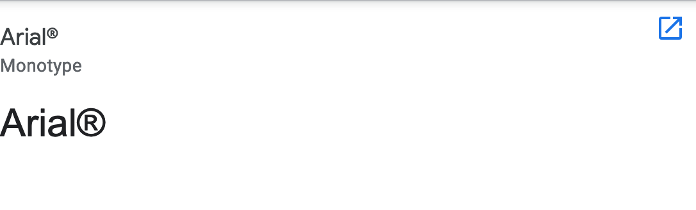
```
]
] <!--end of panel-->

.panel[.panel-name[Other fonts]
.pull-left-narrow[
You can find a wide variety of fonts to use in your slides through [Google Fonts](https://fonts.google.com/):

- Monospace
- Serif
- Sans-serif

]

.pull-right-wide[.center[
```{r, echo=FALSE, out.width="85%"}
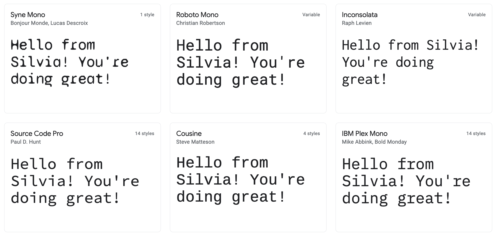
```
]]

] <!--end of panel-->

.panel[.panel-name[How-to: Part 1]

**Step 1.** Select the font style(s) you're interested in using from Google Fonts
.center[
```{r, echo=FALSE}
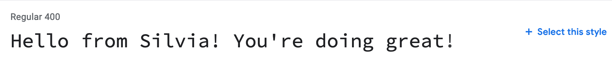
```
]

----

.pull-left[**Step 2.** Copy the `@import` code for your selection:

```{css, eval=FALSE}
@import url('https://fonts.googleapis.com/css2?family=Source+Code+Pro&display=swap');
```

]

.pull-right[
.center[
```{r, echo=FALSE}
knitr::include_graphics("img/font-pick-scp-import.png")
```
]
]
] <!--end of panel-->

.panel[.panel-name[How-to: Part 2]

**Step 3.** Paste the `@import` code into the top of your `nhsr-fonts.css` file

```{css, eval=FALSE}
@import url('https://fonts.googleapis.com/css2?family=Source+Code+Pro&display=swap');
```


**Step 4.** Specify that you want to use the font by adding it to the `font-family` property

```{css, eval=FALSE}
.remark-code, .remark-inline-code {
  font-family: 'Source Code Pro', 'Roboto Mono', monospace;
}
```


] <!--end of panel-->

] <!--end of panelset-->

---
background-image: url(img/party-theme.jpg)
background-size: cover
class: right, bottom

# .my-hot-pink[**Party time! `r emo::ji("partying_face")`**]

### .my-hot-pink[**This is your time**]
### .my-hot-pink[**to have fun**]
### .my-hot-pink[**and play around**]
### .my-hot-pink[**with modifications!**]

---
class: goodbye-slide, inverse, left

.pull-left[
.middle[

# Thank you!

### Here's where you can find me...

.right[
[silvia.rbind.io `r icon::fa("link")`](https://silvia.rbind.io)<br/>
[@spcanelon `r icon::fa("twitter")`](https://twitter.com/spcanelon)<br/>
[@spcanelon `r icon::fa("github")`](https://github.com/spcanelon)<br/>
]]]
